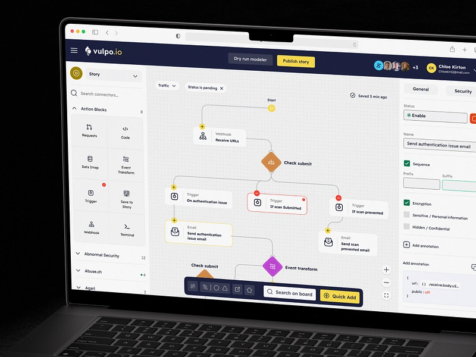
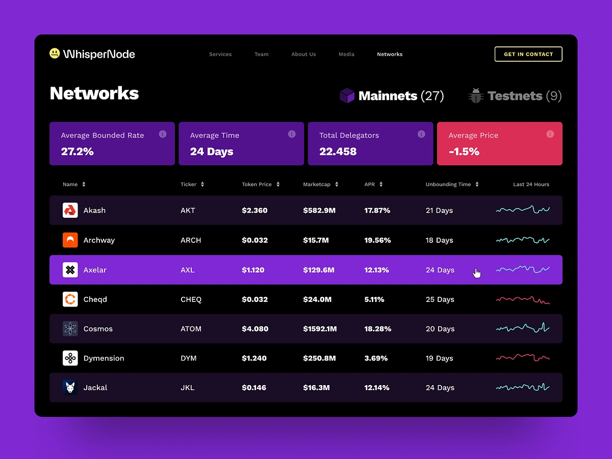
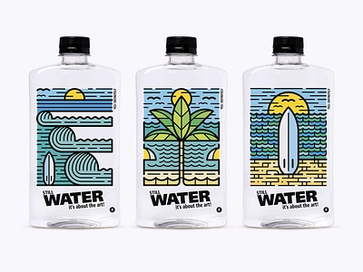
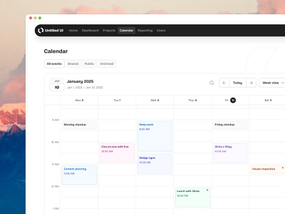
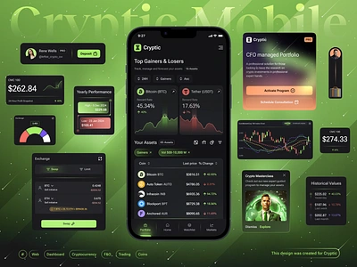
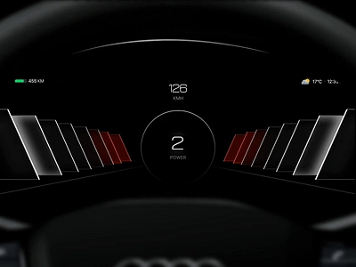

# Project Responsive Web Design using Bootstrap
## Date:25/12/2024

## AIM:
To create a simplified clone of Dribbble (https://dribbble.com/) landing page.


## DESIGN STEPS:

### Step 1:
Clone the repository from GitHub.

### Step 2:
Create Django Admin project.

### Step 3:
Create a New App under the Django Admin project.

### Step 4:
Insert the necessary CSS and JavaScript files as external in order to use Bootstrap.

### Step 5:
Create a HTML file and include the needed Bootstrap components.

### Step 6:
Publish the website in the LocalHost.

## PROGRAM :
```

<!DOCTYPE html>
<html lang="en">
<head>
  <meta charset="UTF-8">
  <meta name="viewport" content="width=device-width, initial-scale=1.0">
  <title>Bootstrap Website</title>
  <link href="https://cdn.jsdelivr.net/npm/bootstrap@5.3.0-alpha3/dist/css/bootstrap.min.css" rel="stylesheet">
</head>
<body>
  <!-- Navbar -->
  <nav class="navbar navbar-expand-lg navbar-light bg-light">
    <div class="container-fluid">
      <a class="navbar-brand" href="#">Dribbble Clone</a>
      <button class="navbar-toggler" type="button" data-bs-toggle="collapse" data-bs-target="#navbarNav" aria-controls="navbarNav" aria-expanded="false" aria-label="Toggle navigation">
        <span class="navbar-toggler-icon"></span>
      </button>
      <div class="collapse navbar-collapse" id="navbarNav">
        <ul class="navbar-nav ms-auto">
          <li class="nav-item"><a class="nav-link" href="#">Shots</a></li>
          <li class="nav-item"><a class="nav-link" href="#">Designers</a></li>
          <li class="nav-item"><a class="nav-link" href="#">Teams</a></li>
          <li class="nav-item"><a class="nav-link" href="#">Community</a></li>
          <li class="nav-item"><a class="nav-link" href="#">Jobs</a></li>
        </ul>
      </div>
    </div>
  </nav>

  <!-- Header Section -->
  <div class="container text-center my-5">
    <h1 class="mb-3">What are you working on?</h1>
    <p>Dribbble is show and tell for designers.</p>
   
    <button class="btn btn-secondary">Sign Up</button>
  </div>

  <!-- Shots Section -->
  <div class="container">
    <div class="row row-cols-1 row-cols-md-4 g-4">
      <!-- Example Card -->
      <div class="col">
        <div class="card h-100">
          
          <div class="card-body">
            <h5 class="card-title">Famous</h5>
          </div>
          <div class="card-footer text-center">
            <small class="text-muted">4,044 views</small>
          </div>
        </div>
      </div>
      
      <div class="col">
        <div class="card h-100">
          
          <div class="card-body">
            <h5 class="card-title">Balkan Brothers</h5>
          </div>
          <div class="card-footer text-center">
            <small class="text-muted">4,234 views</small>
          </div>
        </div>
      </div>

      <div class="col">
        <div class="card h-100">
          
          <div class="card-body">
            <h5 class="card-title">Jan Losert</h5>
          </div>
          <div class="card-footer text-center">
            <small class="text-muted">5,987 views</small>
          </div>
        </div>
      </div>

      <div class="col">
        <div class="card h-100">
          
          <div class="card-body">
            <h5 class="card-title">Mattias Johansan</h5>
          </div>
          <div class="card-footer text-center">
            <small class="text-muted">3,678 views</small>
          </div>
        </div>
      </div>

      <div class="col">
        <div class="card h-100">
          
          <div class="card-body">
            <h5 class="card-title">Ruslan Siiz</h5>
          </div>
          <div class="card-footer text-center">
            <small class="text-muted">4,123 views</small>
          </div>
        </div>
      </div>

      <div class="col">
        <div class="card h-100">
          
          <div class="card-body">
            <h5 class="card-title">Paper Pillar</h5>
          </div>
          <div class="card-footer text-center">
            <small class="text-muted">2,876 views</small>
          </div>
        </div>
      </div>

      <div class="col">
        <div class="card h-100">
          
          <div class="card-body">
            <h5 class="card-title">Alfrey Davilla</h5>
          </div>
          <div class="card-footer text-center">
            <small class="text-muted">8,564 views</small>
          </div>
        </div>
      </div>

      <div class="col">
        <div class="card h-100">
          
          <div class="card-body">
            <h5 class="card-title">InFullMobile</h5>
          </div>
          <div class="card-footer text-center">
            <small class="text-muted">10,543 views</small>
          </div>
        </div>
      </div>


      <!-- Add more cards here -->
    </div>
  </div>

  <!-- Footer -->
  <footer class="bg-light text-center py-3 mt-5">
    <p>Designed and Developed by Aadhav S</p>
  </footer>

  <script src="https://cdn.jsdelivr.net/npm/bootstrap@5.3.0-alpha3/dist/js/bootstrap.bundle.min.js"></script>
</body>
</html>

```

## OUTPUT:
.png>)
.png>)

## RESULT:
The Project for responsive web design using Bootstrap is completed successfully.
