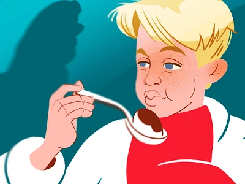

# Project Responsive Web Design using Bootstrap
## Date:25/12/2024

## AIM:
To create a simplified clone of Dribbble (https://dribbble.com/) landing page.


## DESIGN STEPS:

### Step 1:
Clone the repository from GitHub.

### Step 2:
Create Django Admin project.

### Step 3:
Create a New App under the Django Admin project.

### Step 4:
Insert the necessary CSS and JavaScript files as external in order to use Bootstrap.

### Step 5:
Create a HTML file and include the needed Bootstrap components.

### Step 6:
Publish the website in the LocalHost.

## PROGRAM :
```

<html lang="en">
<head>
    <meta charset="UTF-8">
    <meta name="viewport" content="width=device-width, initial-scale=1.0">
    <title>Design Showcase</title>
    <link href="https://cdn.jsdelivr.net/npm/bootstrap@5.3.0/dist/css/bootstrap.min.css" rel="stylesheet">
    <link rel="preconnect" href="https://fonts.googleapis.com">
    <link rel="preconnect" href="https://fonts.gstatic.com" crossorigin>
    <link href="https://fonts.googleapis.com/css2?family=Dancing+Script:wght@400..700&family=Lobster&display=swap" rel="stylesheet">
    <style>
        body {
            background-color: #a8acb1;
        }
        .navbar {
            margin-bottom: 30px;
            font-family: "Lobster", serif;
            font-weight: 400;
            font-style: normal;
        }
        .card img {
            object-fit: cover;
            height: 150px;
            
        }
        .card {
            border: none;
            border-radius: 10px;
            font-family: "Lobster", serif;
            font-weight: 400;
            font-style: normal;
        }
        .card-footer {
            background-color: transparent;
        }
        .footer {
           color: rgb(0, 0, 0);
           padding-left:40% ;
           padding-top:20px ;
           padding-bottom:20px ;
           background-color: white;
           margin-top: 90px;
        } 

    </style>
</head>
<body>
 
    <nav class="navbar navbar-light bg-white shadow-sm">
        <div class="container">
            <a class="navbar-brand fw-bold" href="#">Dribbble Clone</a>
            <form class="d-flex">
                <input class="form-control me-2" type="search" placeholder="Search" aria-label="Search">
                <button class="btn btn-outline-primary" type="submit">Search</button>
            </form>
        </div>
    </nav>

 
    <div class="container text-center mb-5">
        <h1>What are you working on?</h1>
        <p class="text-muted">Dribbble is show and tell for designers.</p>
        <button class="btn btn-primary">Sign up</button>
    </div>


    <div class="container">
        <div class="row row-cols-1 row-cols-sm-2 row-cols-md-4 g-4">
         
            <div class="col">
                <div class="card shadow-sm">
                    
                    <div class="card-footer d-flex justify-content-between align-items-center">
                        <span>Famous</span>
                        <span class="text-muted">4,044 views</span>
                    </div>
                </div>
            </div>

            <div class="col">
                <div class="card shadow-sm">
                    
                    <div class="card-footer d-flex justify-content-between align-items-center">
                        <span>Balkan Brothers</span>
                        <span class="text-muted">2,404 views</span>
                    </div>
                </div>
            </div>

            <div class="col">
                <div class="card shadow-sm">
                    
                    <div class="card-footer d-flex justify-content-between align-items-center">
                        <span>Jan Losert</span>
                        <span class="text-muted">8,909 views</span>
                    </div>
                </div>
            </div>

            <div class="col">
                <div class="card shadow-sm">
                    
                    <div class="card-footer d-flex justify-content-between align-items-center">
                        <span>Mattias Johansan</span>
                        <span class="text-muted">4,567 views</span>
                    </div>
                </div>
            </div>

            <div class="col">
                <div class="card shadow-sm">
                    
                    <div class="card-footer d-flex justify-content-between align-items-center">
                        <span>Ruslan Siiz</span>
                        <span class="text-muted">3,908 views</span>
                    </div>
                </div>
            </div>

            <div class="col">
                <div class="card shadow-sm">
                    
                    <div class="card-footer d-flex justify-content-between align-items-center">
                        <span>Paper Pillar</span>
                        <span class="text-muted">2,445 views</span>
                    </div>
                </div>
            </div>
            <div class="col">
                <div class="card shadow-sm">
                    
                    <div class="card-footer d-flex justify-content-between align-items-center">
                        <span>Alfrey Davilla</span>
                        <span class="text-muted">7,078 views</span>
                    </div>
                </div>
            </div>

            <div class="col">
                <div class="card shadow-sm">
                    
                    <div class="card-footer d-flex justify-content-between align-items-center">
                        <span>inFullMobile</span>
                        <span class="text-muted">5,860 views</span>
                    </div>
                </div>
            </div>


        </div>
    </div>
    <footer class="footer">Designed and Developed by Aadhav S</footer>

    <script src="https://cdn.jsdelivr.net/npm/bootstrap@5.3.0/dist/js/bootstrap.bundle.min.js"></script>
</body>
</html>

```

## OUTPUT:
.png>)

## RESULT:
The Project for responsive web design using Bootstrap is completed successfully.
